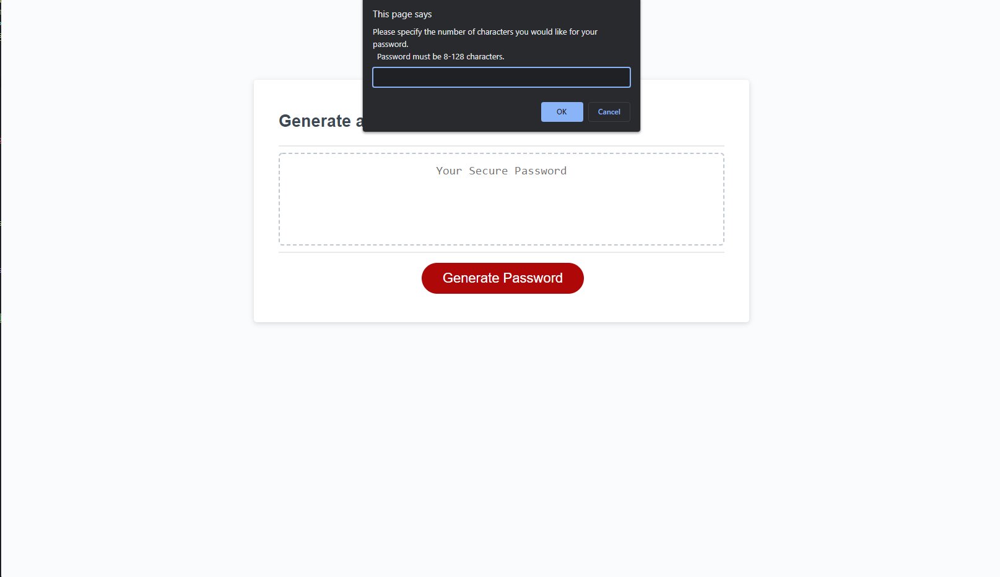

# Random Password Generator

## Description

The purpose of this code was to generate a random password of 8-128 characters so users can have a more secure password. The following code should do the following:

1. Ask user how many characters he/she would like the password to be.

   - If the user does not input a number input or presses the cancel button, it will halt the function with a message.

2. Ask the user if the user would like to add lower case letters to his/her password.
3. Ask the user if the user would like to add capital letters to his/her password.
4. Ask the user if they would like to add numbers to his/her password.
5. Ask the user if they would like to add special characters to his/her password.

Please [click here](https://lunirs.github.io/password-generator/) to be redirected to the deployed link to try and create your own randomized password!

## Table of Contents

1. [Installation](#installation)

2. [Usage](#usage)

3. [Credits](#credits)

4. [License](#license)

## Installation

In order to get this password, there were a couple of steps I needed to take. The first step was to logically plan out what my function would need and would need to do.

Things I would need:

- List of lower case letters
- List of capital letters
- List of numbers
- List of special characters

Things the program would need to recognize based on the user's input:

- Number of characters of the password
  - Is the input a number?
    - If no, ask user to try again
  - Is the input less than 8 or greater than 129?
    - If no, ask the user to input a number within those boundaries.
    - If yes, move on to next step
- Adding other characters
  - Does the user want to add lower case letters?
    - If no, move on. If yes, concat the array of lower case letters to final array
  - Does the user want to add capital letters?
    - If no, move on. If yes, concat the array of capital letters to final array
  - Does the user want to add numbers?
    - If no, move on. If yes, concat the array of numbers to final array
  - Does the user want to add special characters?
    - If no, move on. If yes, concat the array of special characters to final array
  - If user chose none, it should return an undefined password.
- Pick random characters from final array and generate based on number of characters user specified.
- Put together password and then generate.

In order to create my arrays for different criteria, I used the array constructor [ Array() ] to turn my strings into an array.

Once I had that, it was time to create my function.

I made conditions in my while loop to filter out any inputs that were less than 8 or greater than 128.

If the user input any other, it would come back as a message and have them try again.

Once the length criteria was set, the rest is the criteria for the password.

There will be several confirm pages that pop up asking the users to confirm if they would like to add lower case letters, capital letters, numbers, or special characters.

The choices the user presses ok on will trigger an if statement. If the choice is yes, the individual character array will be concatted to the final array which we will be used when generating our password.

Now that the final array is constructed, we would need to choose random characters within that array to add to our password array.

To fulfill this, I used a for loop in which it would generate random characters in the final array to add to the password array. This was set to only run until the index number was one less than the length the user confirmed (since index starts at 0).

Once concatted, the password was returned and the random password was displayed to the user.

## Usage

### The following screenshots show the flow of the random password generator.

### The following screenshots show the error messages when the user inputs:

#### No or wrong input value

#### Input is less than 8 or greater than 128

## Credits

In order to create this program, I had to utilize the following websites to guide me:

- [MDN Web Docs Array() Constructor](https://developer.mozilla.org/en-US/docs/Web/JavaScript/Reference/Global_Objects/Array/Array)
- [MDN Web Docs ParseInt()](https://developer.mozilla.org/en-US/docs/Web/JavaScript/Reference/Global_Objects/parseInt)
- [MDN Web Docs isNaN()](https://developer.mozilla.org/en-US/docs/Web/JavaScript/Reference/Global_Objects/isNaN)
- [MDN Web Docs String.prototype.charAt()](https://developer.mozilla.org/en-US/docs/Web/JavaScript/Reference/Global_Objects/String/charAt)
- [MDN Web Docs While](https://developer.mozilla.org/en-US/docs/Web/JavaScript/Reference/Statements/while)

## License

Copyright (c) [2022] [Daniel Hong]
